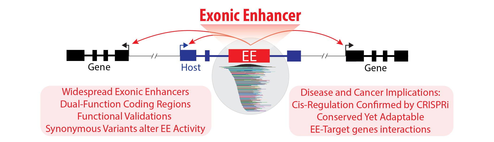

# Scripts — Exonic Enhancers Are a Widespread Class of Dual-Function Regulatory Elements

---

## Description
**Authors**  
Jean-Christophe Mouren (Contact), Magali Torres, Antoinette van Ouwerkerk, Manosalva, Frederic Gallardo, Salvatore Spicuglia, and Benoit Ballester (Contact).

This repository contains the scripts used for data curation, analyses and figures generation in our manuscript:

> **“Exonic enhancers are a widespread class of dual-function regulatory elements.”**  
> In this study, we redefine the role of exonic regions in gene regulation. We demonstrate that many protein-coding exons function as exonic enhancers (EEs): a previously underappreciated class of cis-regulatory elements embedded within exons.

By integrating TF ChIP-seq, chromatin accessibility data (DNase-seq/ATAC-seq), high-throughput enhancer-reporter assays (STARR-seq, luciferase), and CRISPR-based validations, we show that exonic enhancers (EEs) play crucial roles in gene regulatory networks while retaining their protein-coding function.

**Supplementary Data** is available on [Zenodo](https://zenodo.org/record/15079251).

---

## Key Findings

1. **Identification of EEs Across Multiple Species**  
   - Systematic discovery of EEs using TF ChIP-seq, chromatin accessibility, and STARR-seq data.  
   - Many protein-coding exons exhibit enhancer activity.

2. **Dual Coding and Regulatory Roles**  
   - EEs retain protein-coding functions while simultaneously acting as cis-regulatory elements.  
   - Both synonymous and nonsynonymous variants can disrupt EE activity and downstream gene expression.

3. **Long-Range Interactions and Target Gene Regulation**  
   - Promoter capture Hi-C and eQTL analyses confirm interactions between EEs and gene promoters.  
   - CRISPR-based inactivation of EEs demonstrates regulatory effects on both host and distal target genes.

4. **Clinical and Evolutionary Implications**  
   - Pan-cancer (TCGA) analyses show that mutations in EEs correlate with altered gene expression and clinical outcomes.  
   - Evolutionary conservation indicates that EEs are functionally constrained yet contribute to species-specific regulatory innovations.

---

## Repository Contents
Below is a brief description of each folder, organized by thematic for easy navigation and reproducibility :

- **EE_selection/**  
  Scripts used to define exonic enhancers (EEs) based on TF ChIP-seq peaks and additional filtering criteria.

- **Control_selection/**  
  Procedures for generating negative/positive control sets, ensuring unbiased comparisons with EEs.

- **Chromatin_accessibility/**  
  Scritps to curate DNase-seq, ATAC-seq and histones marks datasets assessing open chromatin in exons and EEs across multiple species.

- **Conservation_and_structure/**  
  Scripts for Multi-species and pairwise alignment, phyloP scores, AlphaFold predictions, MobiDB disorder and gene-age analyses for EEs.

- **TF_randomisation/**  
  Scripts used to validate TF-binding within EEs through randomization tests.

- **TFBS_in_EE/**  
  Motif analysis pipeline (e.g., JASPAR-based TFBS predictions) overlapping with exonic enhancers.

- **STARR-seq_experiment/**  
  Analysis scripts for STARR-seq data, including the reads pipeline and SNPs analysis.

- **STARR-seq_catalog/**  
  Data curation of STARR-seq peaks from public data sources, as well as EEs biotype signature definition.

- **G-quadruplex/**  
  Scripts examining G4-forming sequences (G-quadruplex) in EEs vs. control exons.

- **Interaction_data/**  
  Integration of promoter capture Hi-C, eQTL (GTEx), and ENCODE-rE2G resources to identify robust EE–target gene interactions.

- **gnomADv3_analysis/**  
  Variant filtering/annotation pipelines for common variants in gnomAD v3 that intersect with exonic enhancers.

- **GWAS_analysis/**  
  Overlaps of known GWAS loci with EEs to reveal potential trait- and disease-associated variants within coding enhancer regions.

- **PanCancer_analysis/**  
  Somatic mutations from TCGA across multiple cancer types, intersected with EEs; includes scripts for differential expression and survival analysis.

- **UCSC_trackhub/**  
  Configurations for easily visualizing EEs, TF binding, and variant positions in the UCSC Genome Browser.

---

## Usage & Reproducibility

1. **Environment Requirements**  
   - Scripts were primarily run on Python (>= 3.9) and R (>= 4.0).  
   - Required dependencies include common genomic libraries (e.g., Bioconductor packages in R like `GenomicRanges`) and Python packages like `pandas`, `numpy`, and `pybedtools`.

---

## How to Cite

If you use this dataset, software, or any derived resources, please cite:

> Mouren, J.-C., Torres, M., van Ouwerkerk, A., Manosalva, I., Gallardo, F., Spicuglia, S., & Ballester, B.  
> **“Supplementary Data — Exonic enhancers are a widespread class of dual-function regulatory elements.”**  
> Zenodo. [https://doi.org/10.5281/zenodo.15079251](https://doi.org/10.5281/zenodo.15079251)

And the corresponding manuscript:

> Mouren, J.-C., Torres, M., van Ouwerkerk, A., Manosalva, I., Gallardo, F., Spicuglia, S., & Ballester, B.  
> **“Exonic enhancers are a widespread class of dual-function regulatory elements.”** (Manuscript in preparation.)

---

## Contact

For questions regarding the data, scripts, or methods, please contact:

**Jean-Christophe Mouren** & **Benoit Ballester**  
Aix Marseille University, INSERM, TAGC, UMR 1090  
**Emails:**
- jean-christophe.mouren@inserm.fr  
- benoit.ballester@inserm.fr  

---

We hope this repository helps advance research into exonic enhancers and their dual roles in protein coding and gene regulation. Thank you for your interest!

